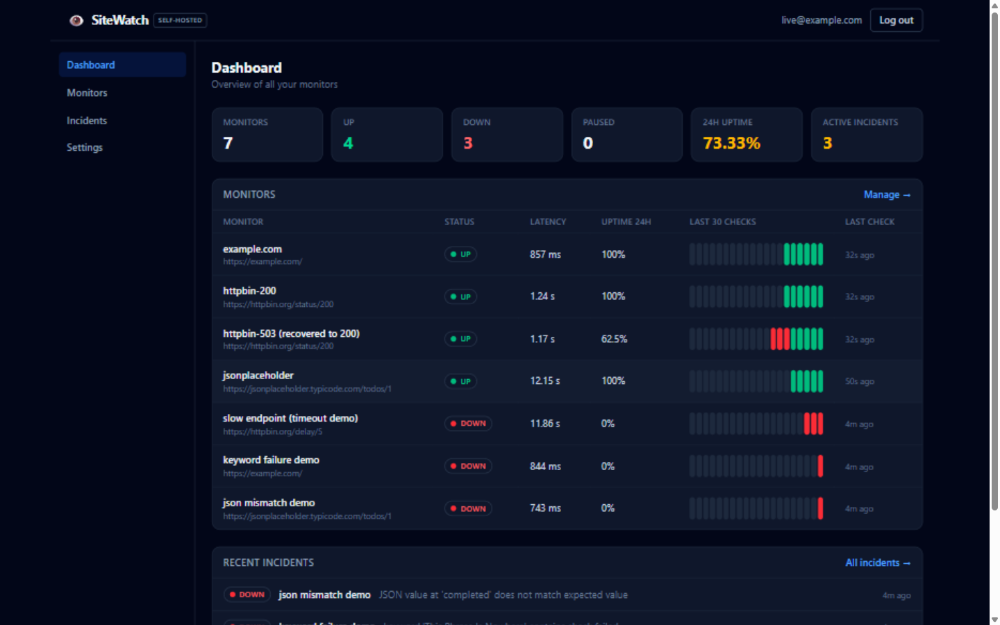
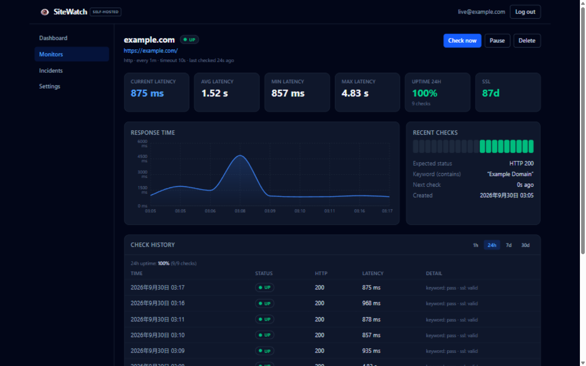
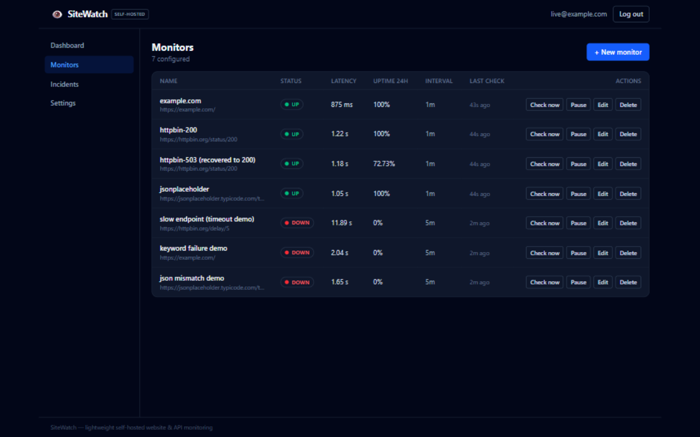
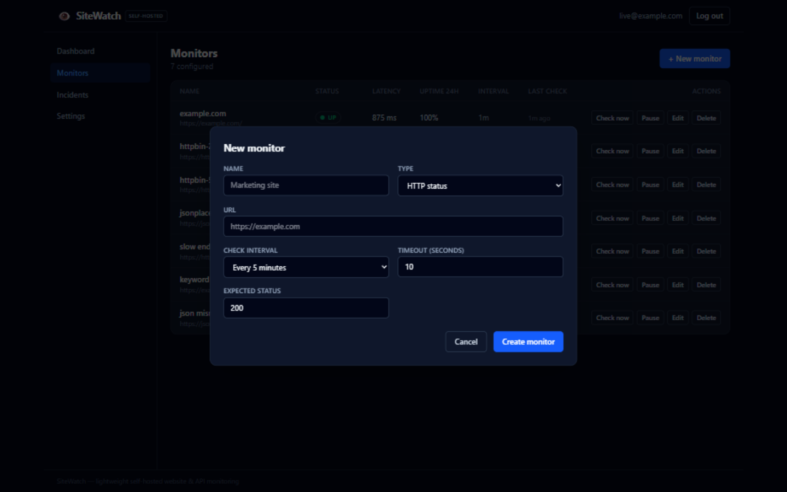
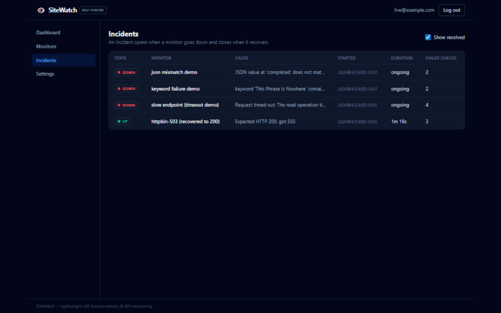
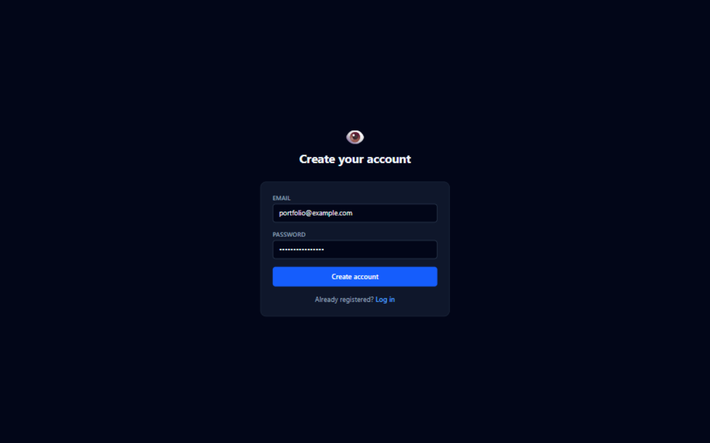

# SiteWatch

A lightweight **self-hosted monitoring platform for websites and APIs** — scheduled
checks, uptime history, response-time tracking, SSL certificate monitoring,
incident tracking, alerts (webhook + email), and a web dashboard.

> Independent portfolio project, built and tested end-to-end. Single-process,
> single-instance by design — simple enough to run on one small VPS.

```bash
cp .env.example .env    # set SECRET_KEY and POSTGRES_PASSWORD
docker compose up -d    # → http://localhost:8080
```

## Features

- **Four check types** (combinable on one monitor):
  - **HTTP** — status-code checks with configurable expected status
  - **Keyword** — body must contain / not contain a string (HTTP 200 + keyword fail ⇒ **DOWN**)
  - **API JSON** — safe dot-path extraction (`data.items.0.status`) with expected-value comparison
    (no `eval`; JSON-aware comparison so `false` matches `false` and `3` matches `3`)
  - **SSL** — certificate expiry via TLS handshake (`ssl`-only monitors, or a sidecar on HTTPS monitors)
- **Scheduler** — every enabled monitor is checked on its interval (60s–24h);
  restart-safe (`next_check_at` persisted), bounded concurrency, one failing
  monitor never blocks others
- **History & uptime** — every check persisted (status, HTTP code, latency, error,
  keyword/JSON/SSL results); uptime % for 1h/24h/7d/30d windows; latency avg/min/max;
  30-day retention (configurable)
- **Incidents** — opens on UP→DOWN, extends while DOWN, closes on recovery,
  with failure counts and duration
- **Alerts** — webhook (per-user URL, configurable in the UI) and email (SMTP via env).
  **Deduplicated**: one alert per state change, not per failed check
- **Auth** — local accounts (bcrypt-hashed passwords), JWT bearer tokens;
  all data is per-user and isolated (other users' monitors return 404)
- **Security** — SSRF guard on every URL the server contacts (see below),
  bounded response size, bounded retries, response timeouts, redirect limits
- **Dashboard** — dark, data-dense UI: summary stats, latency chart, uptime strip,
  check history, incidents, SSL expiry, create/edit/pause/delete/check-now

## Screenshots

_Captured from a real running instance. The numbers come from genuine checks of
public endpoints (example.com, httpbin.org, JSONPlaceholder) performed by this
instance's own scheduler — including the intentionally broken monitors
(`httpbin 503`, timeout, keyword/JSON mismatch) that demonstrate DOWN states,
incidents and alerting. The `keyword failure demo` and `json mismatch demo`
monitors exist precisely to show failure handling._

| Dashboard | Monitor detail |
|---|---|
|  |  |

| Monitors | Create monitor |
|---|---|
|  |  |

| Incidents | Register |
|---|---|
|  |  |

## Architecture

```
Browser (React SPA) ──▶ nginx (frontend container: static files + /api proxy)
                              │
                              ▼
                     FastAPI backend (single process)
                       ├── REST API (routes → services, no logic in routes)
                       ├── Scheduler (daemon thread: scan due monitors)
                       │     └── Check Engine (bounded thread pool)
                       │           ├── HTTPChecker (httpx, SSRF-guarded, redirects validated)
                       │           ├── KeywordRule / JSONRule (pure functions)
                       │           └── SSLChecker (TLS handshake + X.509)
                       ├── Incident state machine (UP→DOWN→UP)
                       └── Notifications (webhook/email, transition-gated)
                              │
                              ▼
                        PostgreSQL (SQLAlchemy 2.x + Alembic migrations)
```

Check execution is separated from scheduling; business logic lives in services;
routes only do HTTP concerns. See [docs/DESIGN.md](docs/DESIGN.md) for the full
pre-implementation design document.

## Tech Stack

| Layer | Choices |
|---|---|
| Backend | Python 3.11+, FastAPI, Pydantic v2, SQLAlchemy 2.x (sync), Alembic, httpx, PyJWT, bcrypt, cryptography |
| Database | PostgreSQL 16 (SQLite supported for local dev/tests) |
| Scheduler | Custom single-process scan loop + `ThreadPoolExecutor` (no Celery/Redis) |
| Frontend | React 18, TypeScript, Vite, Tailwind CSS 4, TanStack Query, react-router, Recharts |
| Tests | pytest (+httpx MockTransport), Vitest + Testing Library |
| Infra | Docker + docker-compose (backend, frontend/nginx, postgres), GitHub Actions CI |

Deliberately **not** included: Celery, Redis, Kafka, RabbitMQ, Kubernetes,
microservice splits — this is a small, mature product, not a distributed system.

## Requirements

- Docker + docker-compose (recommended path), **or**
- Python 3.11+ and Node 22+ for running from source

## Quick Start (from source, no Docker)

```bash
# 1. Backend (uses SQLite locally by default — no Postgres needed to try it)
cd backend
python -m venv .venv && source .venv/bin/activate      # Windows: .venv\Scripts\activate
pip install -e ".[dev]"
export SECRET_KEY=dev-secret-change-me                 # Windows: set SECRET_KEY=...
export APP_ENV=development
alembic upgrade head
uvicorn app.main:app --reload --port 8000              # API on :8000, docs on /docs

# 2. Frontend (dev server proxies /api to :8000)
cd ../frontend
npm install
npm run dev                                            # UI on http://localhost:5173

# 3. (optional) Demo data
cd ../backend
python -m app.seed
```

## Docker

```bash
cp .env.example .env
# .env: set SECRET_KEY (python -c "import secrets; print(secrets.token_urlsafe(48))")
#       set POSTGRES_PASSWORD
docker compose up -d --build
open http://localhost:8080
```

- **backend** container runs `alembic upgrade head && uvicorn app.main:app`
  (schema is created *only* by migrations, never in startup code), non-root user,
  `/health` healthcheck
- **frontend** container: multi-stage build (node → nginx:alpine) serving the SPA
  and proxying `/api` + `/health` to the backend (single origin, no CORS in prod)
- **postgres**: named volume, `pg_isready` healthcheck; backend waits for it

> **Note (honest reporting):** this project was developed in an environment
> without a Docker daemon, so `docker compose up` could not be executed there.
> The images and compose file follow standard practice (multi-stage builds,
> healthchecks, non-root, env-injected secrets) and the application layer is
> fully verified by the test suite and live run documented below — but the
> compose path itself should be re-verified on a machine with Docker.

## Configuration

All configuration is via environment variables (see [.env.example](.env.example)):

| Variable | Default | Purpose |
|---|---|---|
| `SECRET_KEY` | *(required in production)* | JWT signing key |
| `DATABASE_URL` | `sqlite:///./sitewatch.db` | any SQLAlchemy URL (compose sets Postgres) |
| `APP_ENV` | `development` | `production` refuses the dev default secret |
| `MAX_MONITORS_PER_USER` | `50` | per-account monitor limit |
| `MAX_CONCURRENT_CHECKS` | `10` | scheduler worker pool size |
| `SCHEDULER_SCAN_INTERVAL_SECONDS` | `10` | due-scan cadence |
| `CHECK_MAX_RETRIES` | `2` | bounded retries, exponential backoff (transport errors only) |
| `MAX_RESPONSE_BYTES` | `2000000` | response body cap per check |
| `RETENTION_DAYS` | `30` | check-history pruning |
| `WEBHOOK_ALLOW_PRIVATE_IPS` | `false` | allow webhook targets on private networks |
| `SMTP_HOST/PORT/USERNAME/PASSWORD/FROM/TO` | empty | email alerts; empty = disabled |
| `ACCESS_TOKEN_EXPIRE_MINUTES` | `10080` | JWT lifetime (7 days) |

## Authentication

- `POST /api/auth/register` → 201 (email + password ≥ 8 chars)
- `POST /api/auth/login` → `{access_token, token_type: "bearer"}`
- `GET /api/auth/me` with `Authorization: Bearer <token>`

Passwords are bcrypt-hashed (never stored plaintext, never logged). Tokens are
HS256 JWTs. There is no OAuth/RBAC by design.

## Creating a Monitor

In the UI: **Monitors → + New monitor**. Via API: `POST /api/monitors` with
`name`, `target_url`, `type` (`http` | `keyword` | `api_json` | `ssl`),
`interval_seconds` (60–86400), `timeout_seconds` (1–30), `expected_status`, plus
type-specific fields (`keyword`+`keyword_mode`, `json_path`+`json_expected_value`,
`ssl_check_enabled`+`ssl_warning_days`).

Every target URL is validated at creation **and at request time** (see SSRF below).

## Monitor Types & Status Rules

| Situation | Resulting status |
|---|---|
| HTTP status ≠ `expected_status` | DOWN (`status_mismatch`) |
| Timeout / connection / DNS / TLS error | DOWN (with `error_type`) |
| Keyword not contained (or contained, in `not_contains` mode) | **DOWN** (`keyword_failed`) — HTTP 200 does not save you; content failures are downtime |
| JSON unparseable / path missing / value mismatch | DOWN (`json_parse_failed` / `json_failed`) |
| `ssl`-type monitor with expired certificate | DOWN (`ssl_expired`) |
| SSL sidecar on an HTTP monitor expiring | monitor stays UP; separate `ssl_expiring`/`ssl_expired` alerts |
| `http://` target with SSL sidecar | `not_applicable` |

## Alerts

Channels: **webhook** (per-user URL, Settings page, "Send test" button) and
**email** (server-wide SMTP via env; disabled unless fully configured).

Payload example:

```json
{
  "event": "monitor_down",
  "monitor": {"id": 1, "name": "Example", "url": "https://example.com", "type": "http"},
  "status": "down",
  "incident": {"id": 3, "started_at": "...", "cause": "Expected HTTP 200, got 503", "failure_count": 1},
  "timestamp": "2026-09-30T12:00:00+00:00"
}
```

Events: `monitor_down`, `recovered`, `ssl_expiring`, `ssl_expired` (+ `test`).
**Deduplication:** exactly one `monitor_down` per incident, one `recovered` on
resolution, one SSL alert per state transition (re-arms after renewal or after
returning to `ok`). DOWN→DOWN checks send nothing. Every attempt is recorded in
the `notifications` table (sent/failed/skipped).

## Uptime & History

- Every check is stored: status, HTTP code, latency, error, keyword/JSON result, SSL days
- `GET /api/monitors/{id}/checks?hours=1|24|168|720&limit=&offset=` (paginated, newest first)
- `GET /api/monitors/{id}/uptime?window=1h|24h|7d|30d` — only checks that actually
  exist in the window are counted (no future projection)
- Retention: checks older than `RETENTION_DAYS` (default 30) are pruned daily by
  the scheduler

## REST API

Interactive docs: `/docs` (Swagger UI). Endpoints:

```
GET    /health
POST   /api/auth/register            POST /api/auth/login          GET /api/auth/me
PUT    /api/me/notifications         POST /api/me/notifications/test
GET    /api/monitors                 POST /api/monitors
GET    /api/monitors/{id}            PUT  /api/monitors/{id}       DELETE /api/monitors/{id}
POST   /api/monitors/{id}/check      POST /api/monitors/{id}/enable
POST   /api/monitors/{id}/disable
GET    /api/monitors/{id}/checks     GET  /api/monitors/{id}/uptime
GET    /api/monitors/{id}/incidents  GET  /api/incidents?active=true
GET    /api/dashboard/summary        GET  /api/ssl/{monitor_id}?refresh=true
```

Errors use one envelope and never leak tracebacks or DB details:

```json
{"error": {"code": "not_found", "message": "Monitor not found"}}
```

## Security / SSRF Protection

SiteWatch is a tool that fetches URLs on command, so SSRF is treated seriously:

- Scheme restricted to `http`/`https`; embedded credentials rejected
- Hosts are checked with **standard `ipaddress` parsing of resolved addresses**
  (not string matching): loopback, private (10/8, 172.16/12, 192.168/16, CGNAT),
  link-local incl. cloud metadata (`169.254.169.254`), multicast, reserved,
  unspecified and IPv6 equivalents (`::1`, `fe80::/10`, `fc00::/7`,
  IPv4-mapped `::ffff:10.0.0.1`) are all rejected
- Literal IP targets are parsed directly and never resolved via DNS
- Redirects are followed manually (max 5) and **re-validated at every hop**
- Webhook URLs go through the same guard (`WEBHOOK_ALLOW_PRIVATE_IPS=true`
  opts a self-hosted admin out, deliberately)
- Additional hardening: per-check timeout, bounded retries with backoff,
  2 MB response cap, custom `User-Agent`, parameterized queries only
  (SQLAlchemy), bcrypt password hashing, JWT secret from env (refuses the
  dev default in production), unified error envelope, per-user monitor cap

Known limitation: the hostname is re-resolved by the HTTP client after the guard
validates it, so a DNS-rebinding race is mitigated but not eliminated (no
connect-IP pinning). Acceptable for a self-hosted single-tenant tool; documented
honestly rather than hidden.

## Testing

```bash
cd backend  && .venv/Scripts/python -m pytest -q        # 230+ tests
cd frontend && npm test                                  # 28 tests
```

- Backend: fully offline — all HTTP via `httpx.MockTransport`, SSL via a fake
  certificate provider, DNS via a stubbed resolver. Covers auth, password
  hashing, JWT, monitor CRUD + validation, URL/SSRF guard, checkers (timeout,
  retry/backoff, status mismatch, redirect blocking, response caps), keyword,
  JSON, SSL, incident transitions, notification dedup, uptime math, retention,
  scheduler semantics, pagination, and ownership isolation
- Frontend: Vitest + Testing Library — login/register validation + server errors,
  dashboard (stats/empty/error/retry), monitor list + create-form validation,
  badges, uptime strip, formatters
- CI (GitHub Actions): backend on Python 3.11 & 3.13 **against a real Postgres 16
  service** (migration check + full suite), frontend typecheck + tests + build

## CI

`.github/workflows/ci.yml` — no external secrets required; uses an ephemeral
Postgres service for the backend matrix job and `npm ci` for the frontend job.

## Demo

```bash
cd backend
APP_ENV=development python -m app.seed
```

Creates `demo@sitewatch.local` (password from `DEMO_PASSWORD`, or generated and
printed once) and four monitors: example.com (HTTP+keyword+SSL), httpbin 200
(up), **httpbin 503 (permanently down — demonstrates DOWN + incident +
alert-once)**, and a JSONPlaceholder JSON health check. Seed refuses to run with
`APP_ENV=production`. Numbers shown for these monitors in a demo come from real
checks of those public endpoints, at their configured intervals (5–10 min, to
avoid spamming them).

## Project Structure

```
├── backend/
│   ├── app/
│   │   ├── api/routes/        # auth, monitors, incidents, dashboard, ssl, settings
│   │   ├── schemas/           # Pydantic request/response models
│   │   ├── services/          # business logic (monitor, check, uptime, incident, retention, dashboard)
│   │   ├── monitoring/        # url_guard (SSRF), checkers, rules, engine
│   │   ├── notifications/     # webhook/email channels + dedup
│   │   ├── scheduler/         # scan loop + bounded worker pool
│   │   ├── models/            # SQLAlchemy models
│   │   ├── config.py, database.py, main.py, seed.py
│   ├── alembic/               # migrations
│   ├── tests/                 # pytest suite (offline)
│   └── Dockerfile
├── frontend/
│   ├── src/{api,auth,components,pages,utils}
│   ├── tests/                 # vitest suite
│   ├── nginx.conf  Dockerfile
├── docs/DESIGN.md             # pre-implementation design (A–J)
├── docker-compose.yml
└── .github/workflows/ci.yml
```

## Limitations

Stated plainly:

- **Independent portfolio project** — built solo, not a customer deliverable
- **Single-instance scheduler** — run exactly one backend process per database;
  no distributed workers, no HA
- **PostgreSQL in production** (SQLite is fine for trying it out locally)
- **Public HTTP/HTTPS monitoring only** — no browser-level/transaction checks,
  no ICMP/TCP/DNS check types
- **No multi-user teams / RBAC / OAuth** — one account = one user
- **No Kubernetes, no message queues** — intentional
- **No external paid services required** for basic usage; email alerts need any SMTP account
- **Docker compose path not executed in the development environment** (no Docker
  daemon available there) — see the note in the Docker section
- DNS-rebinding TOCTOU is mitigated, not eliminated (see Security section)

Nothing here claims to be "production-ready" or "enterprise-grade" beyond the
evidence in this README and the test suite.
